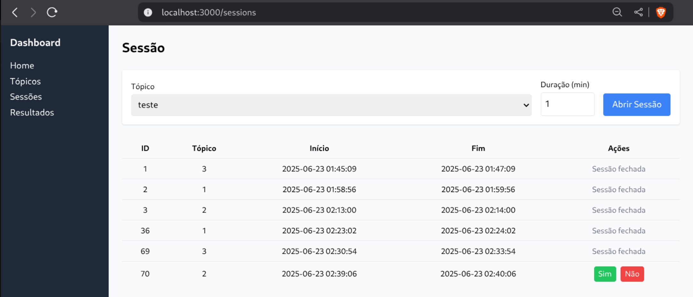

# VoteManager

A modern full-stack voting session management system built with React + TypeScript frontend and FastAPI backend. This application allows users to create voting topics, manage voting sessions, and cast votes in a secure and organized manner.



### Backend (FastAPI)
Follows Clean Architecture principles with clear separation of concerns:

```
backend/
├── app/
│   ├── api/                    # API layer (FastAPI routes)
│   │   ├── routers/           # Route handlers
│   │   ├── schemas/           # Pydantic models
│   │   └── deps.py            # Dependencies
│   ├── application/           # Application layer
│   │   └── protocols/         # Repository interfaces
│   ├── domain/               # Domain layer
│   │   ├── entities/         # Domain entities
│   │   └── services/         # Business logic
│   └── infra/                # Infrastructure layer
│       ├── auth/             # JWT authentication
│       └── db/               # Database models & repositories
├── alembic/                  # Database migrations
└── tests/                    # Test suites
```

### Frontend (React + TypeScript)
Modern React application with Redux Toolkit for state management:

```
frontend/
├── src/
│   ├── components/           # Reusable UI components
│   ├── pages/               # Page components
│   ├── slices/              # Redux slices
│   ├── hooks/               # Custom React hooks
│   └── utils/               # Utilities (API, etc.)
├── public/                  # Static assets
└── dist/                    # Built application
```

## Prerequisites

- **Docker & Docker Compose** (recommended)
- **Node.js 18+** and **Python 3.10+** (for local development)
- **PostgreSQL** (if running without Docker)

## Quick Start

### Using Docker (Recommended)

1. **Clone the repository**
   ```bash
   git clone https://github.com/PedroH183/VoteManager
   cd VoteManager
   ```

2. **Start the application**
   ```bash
   docker-compose up -d
   ```

3. **Access the application**
   - **Frontend**: http://localhost:3000
   - **Backend API**: http://localhost:8000
   - **API Documentation**: http://localhost:8000/docs

### Core Entities

- **Users**: User accounts with CPF and hashed passwords
- **Topics**: Voting topics with titles
- **Sessions**: Timed voting sessions linked to topics
- **Votes**: Individual votes (Sim/Não) from users

### Relationships

- Topics → Sessions (1:N)
- Sessions → Votes (1:N)
- Users → Votes (1:N)

## Testing

### Backend Tests
```bash
cd backend
pytest
```

### Frontend Tests
```bash
cd frontend
npm test
```

### Environment Variables

#### Backend (.env)
```env
POSTGRES_DB=votemanager
POSTGRES_HOST=localhost
POSTGRES_USER=votemanager
POSTGRES_PASSWORD=changeme
SECRET_KEY=your-secret-key-here
ALGORITHM=HS256
ACCESS_TOKEN_EXPIRE_MINUTES=30
```

#### Frontend (.env)
```env
VITE_API_URL=http://localhost:8000
```

## 🐛 Known Issues in frontend

- Session state may be lost on page refresh (fixed with localStorage persistence)
- Error handling for network failures needs improvement
- Real-time updates require manual refresh
- Payload to create a topic is wrong
- UI improvements is necessary

